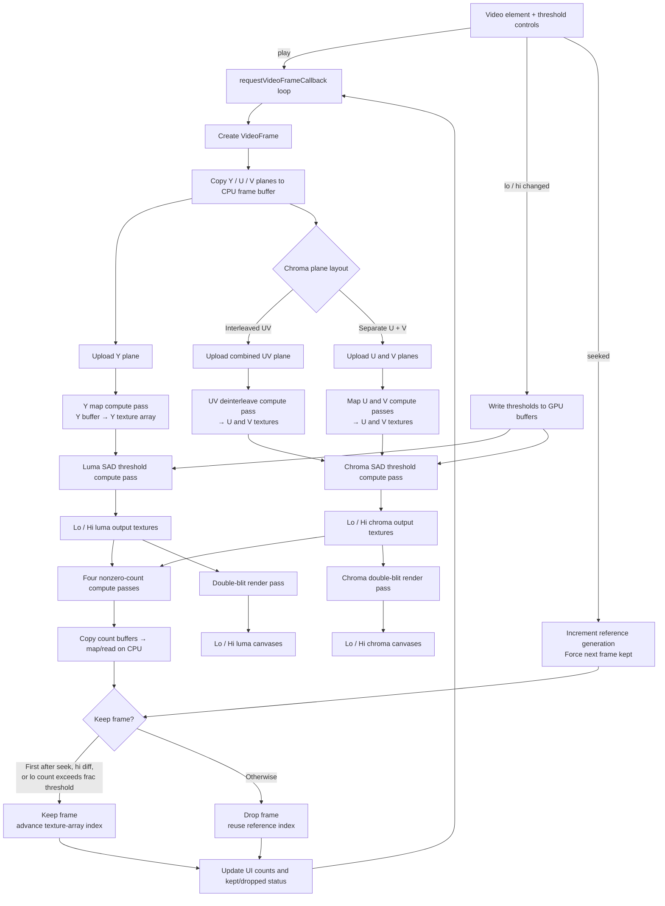

# mpdecimate playground

This website visualizes how [mpdecimate filter](https://ffmpeg.org/ffmpeg-filters.html#toc-mpdecimate) works.

## How to test (monorepo)

The `monorepo/` workspace uses [Rush](https://rushjs.io). Install dependencies once:

```sh
cd monorepo && rush install
```

### Unit tests

Run tests per package with `rushx` from the package directory:

```sh
cd monorepo/libs/interface && rushx test
cd monorepo/libs/webgpu-impl && rushx test
```

Or build and test everything:

```sh
cd monorepo && rush build
```

### Integration tests (webgpu-impl)

`monorepo/libs/webgpu-impl/test/yuv-stream.integration.test.ts` needs
pre-generated test videos. The random parameters that define them are tracked
by git in `monorepo/libs/webgpu-impl/test/parameters/`, so every environment
produces identical videos — but each environment must generate the videos
themselves.

1. Build the `create_test_video` tool:

   ```sh
   cmake --build yuv_stream/cmake-build-debug --target create_test_video
   ```

2. Generate the videos into `monorepo/libs/webgpu-impl/test/generated/`
   (untracked):

   ```sh
   monorepo/libs/webgpu-impl/test/generate-test-videos.sh
   ```

3. Run the tests:

   ```sh
   cd monorepo/libs/webgpu-impl && rushx test
   ```

Only re-run `monorepo/libs/webgpu-impl/test/generate-random-parameters.sh` if
you want to change the test data itself; commit the resulting `parameters/`
files so other environments stay consistent.

## Visualization pipeline of @web project


