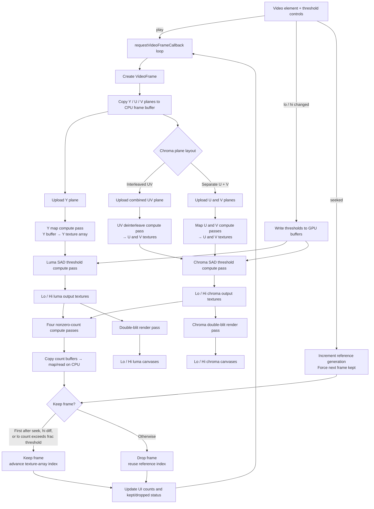

# mpdecimate playground

This website visualizes how [mpdecimate filter](https://ffmpeg.org/ffmpeg-filters.html#toc-mpdecimate) works.

## Visualization pipeline of @web project

```mermaid
flowchart TD
  UI["Video element + threshold controls"] -->|play| Schedule["requestVideoFrameCallback loop"]
  UI -->|lo / hi changed| Thresholds["Write thresholds to GPU buffers"]
  UI -->|seeked| Reset["Increment reference generation<br/>Force next frame kept"]

  Schedule --> Frame["Create VideoFrame"]
  Frame --> Copy["Copy Y / U / V planes to CPU frame buffer"]

  Copy --> YUpload["Upload Y plane"]
  Copy --> ChromaType{"Chroma plane layout"}

  YUpload --> YMap["Y map compute pass<br/>Y buffer → Y texture array"]

  ChromaType -->|Interleaved UV| UVUpload["Upload combined UV plane"]
  UVUpload --> Deinterleave["UV deinterleave compute pass<br/>→ U and V textures"]

  ChromaType -->|Separate U + V| UVSeparate["Upload U and V planes"]
  UVSeparate --> UVMap["Map U and V compute passes<br/>→ U and V textures"]

  YMap --> SAD["Luma SAD threshold compute pass"]
  Deinterleave --> ChromaSAD["Chroma SAD threshold compute pass"]
  UVMap --> ChromaSAD

  Thresholds --> SAD
  Thresholds --> ChromaSAD

  SAD --> LumaOutputs["Lo / Hi luma output textures"]
  ChromaSAD --> ChromaOutputs["Lo / Hi chroma output textures"]

  LumaOutputs --> Count["Four nonzero-count compute passes"]
  ChromaOutputs --> Count
  Count --> Readback["Copy count buffers → map/read on CPU"]

  LumaOutputs --> Blit["Double-blit render pass"]
  ChromaOutputs --> ChromaBlit["Chroma double-blit render pass"]
  Blit --> Canvases["Lo / Hi luma canvases"]
  ChromaBlit --> Canvases2["Lo / Hi chroma canvases"]

  Readback --> Decision{"Keep frame?"}
  Reset --> Decision
  Decision -->|First after seek, hi diff,<br/>or lo count exceeds frac threshold| Keep["Keep frame<br/>advance texture-array index"]
  Decision -->|Otherwise| Drop["Drop frame<br/>reuse reference index"]

  Keep --> Status["Update UI counts and kept/dropped status"]
  Drop --> Status
  Status --> Schedule
```
